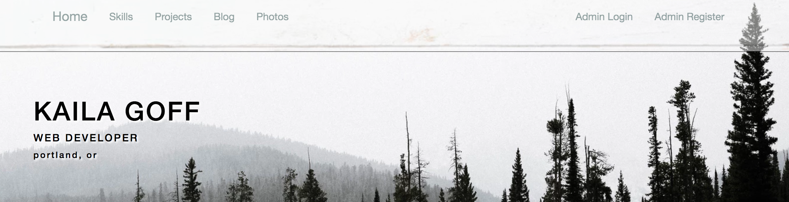

# Portfolio
 _IN PROGRESS_
#### _By Kaila Goff_   

#### _My portfolio website built with Ruby on Rails. 4-27-18_

<kbd></kbd>

## Description
_This is my personal portfolio website. It was built with Ruby on Rails. I used Bootstrap and Sass to help style the website. The Ruby gem Devise was used for authentication on the site, and Paperclip was used for image upload. ActiveRecord was utilized in order to store information to a pSQL relational database._

_The website is divided into several different sections. There is an About Me section that displays my story and current interests. There is a skills and project section that is meant to showcase my current coding abilities. There is also a section that displays some of my recent photography as a way of showing my outside interests. I have also included a blog which I hope to populate with relevant and current posts relating to the tech industry._

### Portfolio site that will include

  * About me section with current interests
  * Skills and Projects
  * Blog with comments
  * Photography section
  * Admin CRUD functionality
  * Devise for Authentication
  * Paperclip for image upload
  * ActiveRecord Database

##### Personal Strengths
  * Always searching for personal and professional growth
  * Analytically and creatively inclined
  * Capable of engaging in endless small talk

##### Personal Interests
  * Photography
  * Drawing
  * Soaking my crystals under a blood moon

## Install the DATABASE instructions

* _Enter into the terminal:_ ``` $bundle install```
* _In the following line enter:_ ```$rake db:create```
* _In the following line enter:_ ```$rake db:migrate```
* _In the following line enter:_ ```$rake db:test:prepare```

## Setup/Installation Requirements

  * _Enter in the terminal:_ ``` $rails server```
  * _Using a web browser, type in the url_ ``` localhost:3000 ```

## Known Bugs

  * _No known bugs at this time._

## Support and contact details

  _To suggest changes, submit a pull request in the GitHub repository._

## Technologies Used

  * HTML5
  * Ruby on Rails
  * pSQL/ActiveRecord
  * Bootstrap/Sass

### License

  *MIT License*

Copyright (c) 2018 **_Kaila Goff_**
